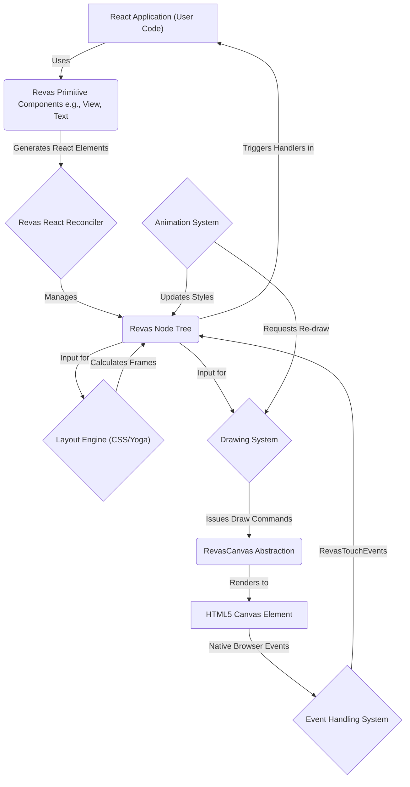

---
# AI Metadata Tags
ai_keywords:
  [
    architecture,
    system,
    overview,
    revas,
    react,
    canvas,
    rendering,
    components,
    core,
  ]
ai_contexts: [architecture]
ai_relations:
  [
    docs/ai-index/overview.md,
    docs/architecture/rendering-pipeline.md,
    docs/architecture/tech-stack.md,
    docs/modules/core/reconciler.md,
    docs/modules/core/node.md,
  ]
---

# Revas System Architecture Overview

This document provides a high-level overview of the Revas system architecture, detailing its main components and how they interact to render React-based UIs on an HTML5 Canvas.

<!-- AI-IMPORTANCE:level=critical -->

## Core Architectural Goal

The primary goal of Revas's architecture is to enable developers to use React's declarative component model and a CSS-like styling approach to build interfaces that are rendered onto a 2D canvas, rather than the traditional DOM. This involves bridging the gap between React's virtual DOM concept and the imperative nature of the Canvas API.

<!-- AI-IMPORTANCE:level=critical -->

## Key Architectural Components

The Revas system is composed of several interconnected components:

<!-- AI-CONTEXT-START:type=architecture -->

1.  **React Application Layer:**

    - Developers write standard React components (`.tsx` or `.jsx` files) using Revas's provided primitive components (e.g., `<View>`, `<Text>`, `<Image>`).
    - This layer manages application state, props, and the overall UI structure declaratively.

2.  **Revas Primitive Components:**

    - These are specialized React components (e.g., [`src/revas/components/View.ts`](../../src/revas/components/View.ts:1), [`src/revas/components/Text.ts`](../../src/revas/components/Text.ts:1)) that act as the building blocks for UIs.
    - They don't render to the DOM directly but serve as instructions for the Revas rendering engine. Internally, they typically use `React.createElement('View', props)` which the reconciler understands.

3.  **React Reconciler (Custom):**

    - Located in [`src/revas/core/reconciler.ts`](../../src/revas/core/reconciler.ts:1).
    - This is the heart of Revas. It's a custom renderer built using the `react-reconciler` package.
    - It takes the output from the React components (React elements) and translates updates into operations on an internal tree of "Revas Nodes" instead of DOM nodes.
    - It handles component mounting, unmounting, and updates.

4.  **Revas Node System:**

    - Defined in [`src/revas/core/Node.ts`](../../src/revas/core/Node.ts:1).
    - An internal tree structure composed of `Node` instances. Each `Node` represents a Revas primitive component instance in the UI.
    - `Node`s store their type (e.g., 'View', 'Text'), props (including styles), calculated layout (frame), and children.
    - This tree is analogous to the browser's DOM tree or React Native's shadow node tree.

5.  **Layout Engine:**

    - Responsible for calculating the size and position (frame) of each `Node` in the tree.
    - Revas supports:
      - A JavaScript-based CSS Flexbox implementation ([`src/revas/core/css-layout/index.ts`](../../src/revas/core/css-layout/index.ts:1)).
      - Integration with Yoga Layout via WebAssembly ([`src/revas/core/yoga-layout/index.ts`](../../src/revas/core/yoga-layout/index.ts:1)) for more comprehensive Flexbox support.
    - Layout is typically triggered after the Node tree is updated by the reconciler.

6.  **Drawing System:**

    - Defined in [`src/revas/core/draw.ts`](../../src/revas/core/draw.ts:1).
    - Traverses the Revas Node tree (after layout calculation).
    - For each `Node`, it interprets its type and style properties to issue specific drawing commands (e.g., draw rectangle, draw text, draw image) to the `RevasCanvas`.
    - Manages transformations (translate, scale, rotate), opacity, and clipping.

7.  **RevasCanvas Abstraction:**

    - Defined in [`src/revas/core/Canvas.ts`](../../src/revas/core/Canvas.ts:1).
    - An abstraction layer over the native HTML5 Canvas 2D context.
    - Provides a consistent API for drawing operations and manages canvas state (transformations, fill styles, etc.).
    - Includes an offscreen caching mechanism ([`src/revas/core/offscreen.ts`](../../src/revas/core/offscreen.ts:1)) to optimize rendering performance for static or complex sub-trees.

8.  **Event Handling System:**

    - Captures native browser events (e.g., touchstart, touchmove, touchend) from the main canvas element.
    - Translates these events into a Revas-specific event format ([`RevasTouchEvent`](../../src/revas/core/Node.ts:34)).
    - The [`Container`](../../src/revas/core/Container.ts:1) class, which holds the root `Node`, is responsible for hit-testing and dispatching these events to the appropriate target `Node`s based on their frame and `pointerEvents` prop.

9.  **Animation System:**
_ Provided via [`src/revas/core/Animated.ts`](../../src/revas/core/Animated.ts:1).
_ Allows for time-based animations of style properties using `AnimatedValue` and `timing` functions. \* Integrates with the rendering loop to update node styles and trigger re-draws.
<!-- AI-CONTEXT-END -->

## High-Level Data and Control Flow

<!-- AI-IMPORTANCE:level=high -->

The general flow of information and control in Revas is as follows:

1.  **Initialization:**

    - A Revas application is started by calling the `render()` function (e.g., from [`src/revas/web/render.ts`](../../src/revas/web/render.ts:1) for web).
    - This sets up a root canvas element, a `Container` instance, and initializes the custom React reconciler with this container.

2.  **Initial Render:**

    - React renders the root application component.
    - The Revas reconciler processes the React elements, creating a corresponding tree of Revas `Node`s.
    - The layout engine calculates the frames for all `Node`s.
    - The drawing system traverses the `Node` tree and renders each `Node` onto the `RevasCanvas`.

3.  **Updates (e.g., State Change, Prop Change):**

    - A React component updates due to a state or prop change.
    - React informs the Revas reconciler of the changes.
    - The reconciler updates the affected Revas `Node`s (e.g., updates props, adds/removes child nodes).
    - The layout engine re-calculates layout for affected parts of the tree.
    - The `Container` schedules a re-draw.
    - The drawing system re-renders the necessary parts of the `Node` tree to the `RevasCanvas`.

4.  **Event Handling:**
_ User interacts with the canvas (e.g., a touch).
_ The browser emits a native event on the canvas element.
_ Revas's top-level event listeners capture this event.
_ The event is transformed and passed to the `Container`.
_ The `Container` performs hit-testing against the `Node` tree to identify the target `Node`(s).
_ Appropriate event handlers (e.g., `onTouchStart`) on the target `Node`(s) and their ancestors are invoked. \* Event handlers may trigger React state changes, leading back to the update cycle.
<!-- AI-IMPORTANCE:level=high -->

## Visual Architecture Diagram

This overview provides a foundational understanding of Revas's architecture. For more detailed information on specific components, please refer to their respective documentation linked throughout this document.
