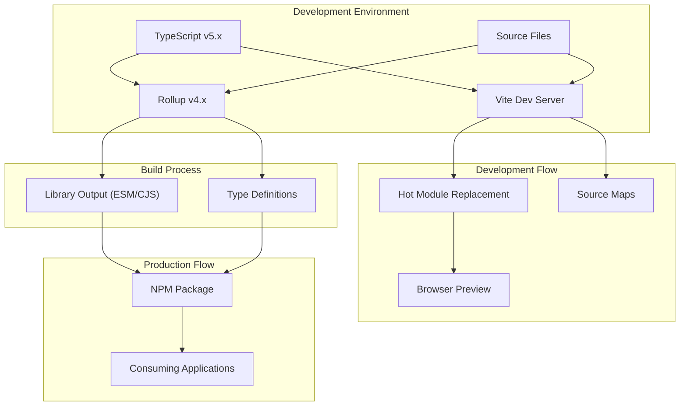

---
# AI Metadata Tags
ai_keywords:
  [
    tooling,
    modernization,
    bundler,
    development server,
    TypeScript,
    Rollup,
    Vite,
    upgrade,
    build,
    workflow,
  ]
ai_contexts: [development]
ai_relations:
  [
    docs/architecture/tech-stack.md,
    docs/dev-guides/setup.md,
    package.json,
    rollup.config.ts,
  ]
---

# Revas Tooling Modernization Plan

This document outlines the comprehensive plan to modernize the tooling for the Revas project. The plan focuses on upgrading the bundler, development server, and TypeScript to support modern JavaScript/TypeScript features and reduce maintenance burden.

## Current State Analysis

The Revas project currently uses:

- **Bundler**: Rollup v1.31.1 (from 2020) with outdated plugins
- **Development Server**: React Scripts v4.0.1 (Create React App based)
- **TypeScript**: v4.0.0
- **React**: v17.0.0
- **Build Process**: Two-phase process with TypeScript compilation followed by Rollup bundling

This setup has several limitations:

- Outdated Rollup plugins that may have security vulnerabilities
- Slower development server compared to modern alternatives
- Limited support for newer JavaScript/TypeScript features
- Complex setup with two-phase build process

## Modernization Goals

1. Upgrade to modern build tools with better performance
2. Support the latest TypeScript features
3. Simplify the development workflow
4. Maintain compatibility with the core Revas architecture
5. Improve developer experience with faster feedback loops

## Detailed Upgrade Plan

### Phase 1: Upgrade TypeScript and Dependencies

1. **TypeScript Upgrade**

   - Upgrade TypeScript from v4.0.0 to latest (v5.4.x)
   - Update tsconfig.json to use newer features and stricter type checking

2. **Core Dependencies Update**
   - Update react-reconciler to latest version compatible with React 17
   - Update other core dependencies like yoga-layout-wasm and bezier-easing

### Phase 2: Modernize Build Tools

1. **Rollup Upgrade for Library Building**

   - Upgrade Rollup to v4.x
   - Replace outdated plugins with modern equivalents:
     - rollup-plugin-typescript2 → @rollup/plugin-typescript
     - rollup-plugin-commonjs → @rollup/plugin-commonjs
     - rollup-plugin-node-resolve → @rollup/plugin-node-resolve
     - rollup-plugin-json → @rollup/plugin-json
   - Implement modern output formats (ESM as primary, CJS as secondary)
   - Add dts-bundle-generator for improved TypeScript declaration files

2. **Vite Integration for Development**
   - Replace React Scripts with Vite for the demo application
   - Configure Vite to use the source files directly during development
   - Set up HMR (Hot Module Replacement) for faster development iterations
   - Create vite.config.ts with appropriate settings for React and TypeScript

### Phase 3: Workflow Improvements

1. **Simplified Build Scripts**

   - Replace the two-phase build process with a single Rollup command
   - Update npm scripts in package.json
   - Add development-specific build modes

2. **Development Experience Enhancements**
   - Configure source maps for better debugging
   - Add build caching for faster rebuilds
   - Implement watch mode for library development

### Phase 4: Testing and Documentation Updates

1. **Ensure Compatibility**

   - Verify the upgraded tools maintain compatibility with the core Revas architecture
   - Test rendering pipeline, event handling, and layout calculations
   - Address any compatibility issues

2. **Update Documentation**
   - Update setup.md with new development workflow instructions
   - Update tech-stack.md to reflect new tooling
   - Update any code examples if necessary

## Architecture Diagram



## File Structure Changes

The updated project will maintain its current file structure with a few additions:

```
revas/
├── src/                  # Source files (unchanged)
│   ├── revas/            # Library source (unchanged)
│   └── develop/          # Demo app source (unchanged)
├── dist/                 # Built library output (unchanged)
├── vite.config.ts        # NEW: Vite configuration
├── tsconfig.json         # UPDATED: Modern TypeScript config
├── rollup.config.mjs     # UPDATED: Modern Rollup config as ESM
└── package.json          # UPDATED: New dependencies and scripts
```

## Implementation Approach

The implementation will be divided into the following steps:

1. **Initial Setup and Testing**

   - Create a new branch for the tooling upgrade
   - Set up TypeScript upgrade and test compatibility
   - Initialize Vite configuration without modifying existing code

2. **Incremental Transition**

   - Gradually migrate build scripts to use new tools
   - Test library builds with new Rollup configuration
   - Develop parallel demo app setup with Vite before full migration

3. **Full Migration**

   - Complete transition to new toolchain
   - Remove old build dependencies
   - Verify all functionality works as expected

4. **Finalization**
   - Update documentation
   - Create pull request with detailed changelog

## Specific Technology Choices

1. **Bundler**: Rollup v4.x

   - Maintains compatibility with library-oriented builds
   - Excellent TypeScript integration
   - Powerful tree-shaking capabilities

2. **Development Server**: Vite v5.x

   - Significantly faster than webpack-based CRA
   - Native ESM support
   - Better HMR implementation
   - Simpler configuration

3. **TypeScript**: v5.4.x
   - Latest stable version
   - Improved type checking and inference
   - Better performance
   - Modern language features support

## Risks and Mitigations

| Risk                            | Likelihood | Impact | Mitigation                                                                |
| ------------------------------- | ---------- | ------ | ------------------------------------------------------------------------- |
| Breaking changes in TypeScript  | Medium     | Medium | Start with type-check only, then incrementally adopt stricter settings    |
| React compatibility issues      | Low        | High   | Test thoroughly with React 17, prioritize compatibility over new features |
| Build output differences        | Medium     | Medium | Compare output bundles before/after to ensure consistency                 |
| Development workflow disruption | Medium     | Low    | Maintain parallel setups until new workflow is confirmed stable           |

## Benefits of the New Setup

1. **Developer Experience**:

   - Faster development server with HMR
   - Quicker feedback loops
   - Modern tooling with better documentation

2. **Code Quality**:

   - Better TypeScript integration
   - More reliable type checking
   - Modern language features

3. **Performance**:

   - Faster builds
   - Improved bundle size
   - Better tree-shaking

4. **Maintainability**:
   - Simpler configuration
   - Actively maintained dependencies
   - Easier to update in the future
