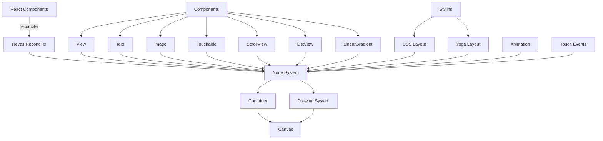
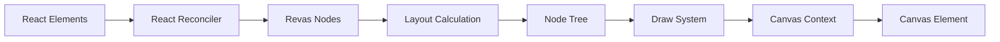
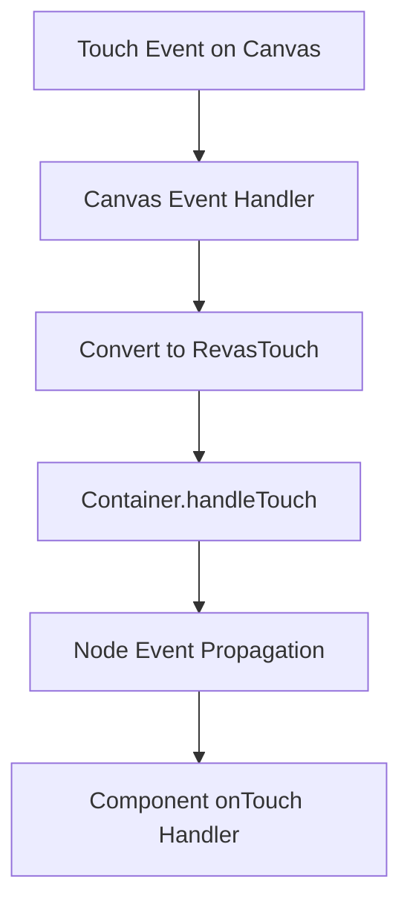
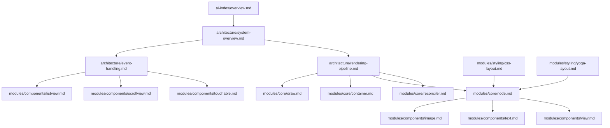

# AI-Optimized Documentation Management System Plan for Revas

Based on my analysis of the revas project and your feedback, I've created a comprehensive plan for building an AI-optimized documentation management system focused on explaining the existing architecture and implementation details to help AI assistants understand how the current revas system works.

## 1. Project Analysis and Documentation Structure

### 1.1 Project Type Analysis

Revas is a frontend library that enables building UI interfaces on canvas using React and CSS syntax. Key features include:

- React-like component system for canvas rendering
- Flexible CSS styling similar to React Native
- Animation capabilities
- Touch event handling
- Specialized components (View, Text, Image, ScrollView, ListView, etc.)
- Layout system using both CSS layout and yoga-layout-wasm

From examining the codebase, I identified these core architectural elements:

- React reconciler integration for managing component trees
- Node system for representing UI elements
- Container system for managing the root node and rendering
- Canvas abstraction for drawing operations
- Drawing system for rendering nodes to canvas
- Event handling system for touch interactions
- Layout calculation using CSS principles and yoga-layout

### 1.2 Documentation Directory Structure

```
docs/
├── ai-index/              # Core AI navigation index
│   ├── overview.md        # System overview
│   ├── navigation-guide.md # Document navigation guide
│   └── documentation-guide.md # Documentation standards guide
├── architecture/          # System architecture documents
│   ├── system-overview.md # Revas architecture overview
│   ├── tech-stack.md      # Technology stack details
│   ├── rendering-pipeline.md # How React components render to canvas
│   └── event-handling.md  # Touch and event system
├── modules/               # Documents organized by functional module
│   ├── core/              # Core functionality
│   │   ├── reconciler.md  # React reconciler documentation
│   │   ├── canvas.md      # Canvas abstraction
│   │   ├── node.md        # Node system
│   │   ├── container.md   # Container system
│   │   ├── draw.md        # Drawing system
│   │   ├── offscreen.md   # Offscreen caching system
│   │   └── animation.md   # Animation system
│   ├── components/        # Component documentation
│   │   ├── view.md        # View component
│   │   ├── text.md        # Text component
│   │   ├── image.md       # Image component
│   │   ├── touchable.md   # Touchable component
│   │   ├── scrollview.md  # ScrollView component
│   │   ├── listview.md    # ListView component
│   │   └── lineargradient.md # LinearGradient component
│   └── styling/           # Styling system
│       ├── css-layout.md  # CSS layout system
│       └── yoga-layout.md # Yoga layout system
├── dev-guides/            # Development guides
│   ├── setup.md           # Environment setup
│   └── troubleshooting.md # Troubleshooting
├── tasks/                 # Task plans
│   └── examples.md        # Example implementations
└── maintenance/           # Maintenance documents
    └── changelog.md       # Change log
```

## 2. Rule File Structure

```
.roo/                   # AI assistant rule file directory
├── rules/
│   └── rules.md        # General rules: document access, usage methods, mode collaboration, MCP usage scenarios
├── rules-architect/
│   └── rules.md        # Architect mode specific rules (3-5 core rules)
├── rules-code/
│   └── rules.md        # Code mode specific rules (3-5 core rules)
├── rules-summary/
│   └── rules.md        # Summary mode specific rules (3-5 core rules)
├── rules-test/
│   └── rules.md        # Test mode specific rules (3-5 core rules)
```

In the root directory, we'll create the `.roomodes` file for custom mode definitions.

## 3. Documentation Implementation Plan

### 3.1 Core Content Development

#### 3.1.1 AI Index

- **overview.md**:

  - High-level explanation of revas's purpose and core functionality
  - Architecture summary with key components and relationships
  - Core value proposition (React + CSS on canvas)
  - When and why to use revas

- **navigation-guide.md**:

  - Paths for different use cases:
    - Beginner's Path: overview.md → rendering-pipeline.md → components/view.md
    - System Architecture Path: system-overview.md → core/_ documents → styling/_ documents
    - Feature Development Path: appropriate component docs → core implementation details
    - Troubleshooting Path: troubleshooting.md → specific component/core docs
    - Project History Path: changelog.md → specific technical implementation details

- **documentation-guide.md**:
  - Document lifecycle process
  - Metadata and structural specifications
  - AI marker usage guide
  - Quality assurance process

#### 3.1.2 Architecture Documents

- **system-overview.md**:

  - High-level architecture diagram
  - Component relationships
  - Data flow descriptions
  - Core subsystems explanation

- **tech-stack.md**:

  - React reconciler integration details
  - Canvas API usage
  - Layout engines (CSS layout and yoga-layout-wasm)
  - Dependencies and their purposes

- **rendering-pipeline.md**:

  - Step-by-step flow from React components to canvas
  - Reconciliation process
  - Layout calculation
  - Drawing process with code examples
  - Performance considerations

- **event-handling.md**:
  - Touch event system architecture
  - Event propagation model
  - Event handler implementation details
  - Gesture recognition process

#### 3.1.3 Module Documents

Each module document will include:

- **Core Module Documentation**:

  - Implementation details with code references
  - API reference with parameters and return types
  - Internal relationships with other modules
  - Key algorithms explained
  - Performance considerations

- **Component Documentation**:

  - Implementation details
  - Props and their meanings
  - Layout behavior
  - Event handling specifics
  - Styling capabilities
  - Example usage

- **Styling Documentation**:
  - Supported CSS properties
  - Layout calculation algorithms
  - Style inheritance and cascading
  - Platform-specific considerations

#### 3.1.4 Development Guides

- **setup.md**:

  - Environment prerequisites
  - Installation process
  - Integration with existing projects
  - Development workflow

- **troubleshooting.md**:
  - Common issues and solutions
  - Debugging techniques
  - Performance optimization

### 3.2 Metadata and Content Marking Implementation

#### 3.2.1 Metadata Tags

Each document will include metadata tags at the beginning:

```markdown
---
# AI Metadata Tags
ai_keywords: [keyword1, keyword2, ...] # Topic keywords for precise AI search
ai_contexts: [architecture|development|implementation|usage] # Document purpose classification
ai_relations: [path/to/related/doc1, path/to/related/doc2, ...] # Document relationships
---
```

Example for the Node system:

```markdown
---
# AI Metadata Tags
ai_keywords: [node, tree, component, frame, touch, events]
ai_contexts: [architecture, implementation]
ai_relations:
  [
    modules/core/container.md,
    modules/core/draw.md,
    architecture/rendering-pipeline.md,
  ]
---
```

#### 3.2.2 Content Marking System

We'll implement importance markers:

```markdown
<!-- AI-IMPORTANCE:level=critical -->

The Node system is the foundation of revas's component hierarchy. Each Node represents a UI component
with position, dimensions, children, and properties. The container manages the root node.

<!-- AI-IMPORTANCE:level=high -->

Nodes maintain a parent-child relationship that's crucial for event propagation and layout calculations.

<!-- AI-IMPORTANCE:level=normal -->

You can access a node's immediate parent through the parent property.
```

And contextual information blocks:

```markdown
<!-- AI-CONTEXT-START:type=architecture -->

The Node class interfaces with the React reconciler through ReactReconciler.createInstance()
which creates a new Node for each React element. This enables the component tree to mirror the
React element tree structure.

<!-- AI-CONTEXT-END -->

<!-- AI-CONTEXT-START:type=implementation -->

When implementing components that extend Node functionality, ensure you maintain the parent-child
relationship by properly handling appendChild and removeChild operations.

<!-- AI-CONTEXT-END -->
```

## 4. Rule File Implementation

### 4.1 General Rules

The general rule file (`.roo/rules/rules.md`) will include:

```markdown
# General Rules for AI Assistants Working with Revas

## Document Access Patterns

AI assistants should access documentation in this recommended order:

1. Start with `docs/ai-index/overview.md` to understand the project scope
2. For architectural questions, refer to documents in the `docs/architecture/` directory
3. For component-specific questions, check relevant files in `docs/modules/components/`
4. For core implementation details, review files in `docs/modules/core/`
5. For styling questions, explore `docs/modules/styling/`

## Mode Collaboration Workflow

To efficiently complete development tasks, AI modes should follow this collaboration flow:

1.  **Architect Mode**:

    - Responsible for initial project planning and design.
    - Upon completion, typically switches to **Code Mode** for specific implementation.

2.  **Code Mode**:

    - Responsible for code writing, debugging, and unit testing.
    - After all coding work is done, should switch to **Test Mode** for comprehensive testing.

3.  **Test Mode**:

    - Responsible for preparing test resources and executing tests.
    - If issues are found during testing, should switch back to **Code Mode** for fixes.
    - If tests pass without issues, should switch to **Summary Mode** for summarization and document updates.

4.  **Summary Mode**:
    - After tests pass, responsible for summarizing work and updating all relevant documents.
    - Ensures documentation is consistent with the final implementation.

## MCP Usage Scenarios

### Playwright

- **Scenario 1**: Visual testing and verification of Revas components rendered on canvas
- **Scenario 2**: Testing touch and gesture interactions with Revas components
- **Scenario 3**: Capturing screenshots of components for documentation

### Perplexity

- **Scenario 1**: Query unfamiliar canvas rendering techniques used in the code
- **Scenario 2**: Understand complex CSS layout calculations
- **Scenario 3**: Research canvas performance optimization strategies
```

### 4.2 Mode-Specific Rules

Each mode-specific rule file will contain only 3-5 core rules, for example:

**Architect Mode Rules** (`.roo/rules-architect/rules.md`):

```markdown
# Architect Mode Core Rules for Revas

1. **Preserve React-Canvas Integration Pattern**: Any architectural recommendations should maintain the current pattern where React components are rendered to canvas through the reconciler.

2. **Respect Layout System**: Always consider both CSS Layout and Yoga Layout systems when analyzing or proposing architectural changes.

3. **Maintain Component Hierarchy**: The Node-based component hierarchy is fundamental to the library; preserve this design pattern in all architectural work.

4. **Consider Canvas Performance**: All architectural decisions should account for canvas rendering performance implications.
```

**Code Mode Rules** (`.roo/rules-code/rules.md`):

```markdown
# Code Mode Core Rules for Revas

1. **Follow Existing Patterns**: Match existing code style and patterns when implementing new features or fixing bugs.

2. **Canvas Drawing Optimization**: Be mindful of canvas drawing operations; minimize redraws and use the caching system appropriately.

3. **Component Structure**: When creating or modifying components, follow the pattern where components are thin wrappers that create React elements.

4. **Type Safety**: Maintain proper TypeScript typing for all methods and properties.

5. **Touch Event Handling**: Follow the existing touch event propagation system for all interactive components.
```

**Test Mode Rules** and **Summary Mode Rules** would follow a similar concise pattern.

## 5. Custom Mode Configuration

We'll set up the `.roomodes` file with custom modes:

```json
{
  "customModes": [
    {
      "slug": "test",
      "name": "🧪 Test",
      "roleDefinition": "You are a professional Revas tester capable of creating test plans, executing tests, and providing solutions.",
      "customInstructions": "After entering Test Mode:\n\n1. Check for compilation errors\n2. Create a test plan focusing on canvas rendering and interaction\n3. Add debugging information for canvas elements\n4. Run test cases using canvas inspection techniques\n5. Propose fix solutions that align with revas architecture\n6. Ensure all tests pass visual and functional verification",
      "groups": ["read", "edit", "command", "mcp", "browser"],
      "source": "project"
    },
    {
      "slug": "summary",
      "name": "🗒️ Summary",
      "roleDefinition": "You are a very experienced Revas programmer and architect, especially skilled at structuring summaries of completed work.",
      "customInstructions": "Summary Mode Steps:\n\n1. **Review Documentation Standards** in docs/ai-index/documentation-guide.md\n2. **Assess Implementation** against existing documentation\n3. **Update Documentation** with appropriate AI metadata tags\n4. **Ensure Consistency** between code and documentation\n5. **Update Key Files** including navigation guides\n6. **Validate Quality** using documentation checklists\n7. **Ensure Completeness** of architecture and implementation details",
      "groups": ["read", "edit", "browser", "command", "mcp"],
      "source": "project"
    }
  ]
}
```

## 6. MCP Service Integration

### 6.1 Playwright Integration

Specific focus on canvas testing capabilities:

````markdown
## Playwright Integration for Canvas Testing

When testing revas components with Playwright, use these specialized approaches:

1. **Canvas Element Capture**:
   ```javascript
   const canvas = await page.locator('canvas').first();
   const screenshot = await canvas.screenshot();
   // Compare screenshot with baseline
   ```
````

2. **Touch Event Simulation**:

   ```javascript
   await page.touchscreen.tap(100, 200); // Simulates touch at x:100, y:200
   ```

3. **Animation Testing**:
   ```javascript
   // Wait for animation frame
   await page.waitForTimeout(50);
   // Capture multiple frames
   for (let i = 0; i < 10; i++) {
     await canvas.screenshot({ path: `frame-${i}.png` });
     await page.waitForTimeout(100);
   }
   ```

````

### 6.2 Perplexity Usage

```markdown
## Perplexity Query Patterns

When using Perplexity to research canvas techniques, use these query patterns:

1. For rendering optimization:
   "Canvas batch rendering techniques similar to {specific revas approach}"

2. For layout algorithms:
   "Efficient CSS flexbox implementation for canvas without DOM"

3. For animation performance:
   "Canvas animation optimization without requestAnimationFrame overuse"
````

## 7. Implementation Process

### 7.1 Phase 1: Setup and Core Documents (Days 1-3)

1. **Create Directory Structure** (Day 1)

   - Set up main documentation directory structure
   - Create placeholder files for all documentation

2. **Create Core Index Documents** (Day 1-2)

   - Develop overview.md with system summary
   - Create navigation-guide.md with primary navigation paths
   - Write documentation-guide.md with standards

3. **Create Architecture Documents** (Day 2-3)
   - Develop system-overview.md with architecture diagrams
   - Document tech-stack.md with dependencies and technologies
   - Create detailed rendering-pipeline.md
   - Document event-handling.md for touch system

### 7.2 Phase 2: Module Documentation (Days 4-8)

4. **Create Core Module Documentation** (Day 4-5)

   - Document reconciler.md
   - Document node.md and container.md
   - Document draw.md and canvas.md
   - Document animation.md and offscreen.md

5. **Create Component Documentation** (Day 6-7)

   - Document basic components (View, Text, Image)
   - Document interactive components (Touchable)
   - Document complex components (ScrollView, ListView, LinearGradient)

6. **Create Styling Documentation** (Day 7-8)
   - Document css-layout.md
   - Document yoga-layout.md
   - Document styling capabilities and limitations

### 7.3 Phase 3: Configuration and Rule Files (Days 9-11)

7. **Create Rule Files** (Day 9)

   - Develop general rules.md
   - Create mode-specific rule files

8. **Set Up Custom Modes** (Day 10)

   - Configure .roomodes file
   - Define custom instructions for each mode

9. **Configure MCP Services** (Day 11)
   - Set up Playwright integration guidance
   - Develop Perplexity usage scenarios

### 7.4 Phase 4: Review and Finalization (Days 12-14)

10. **Verify Document Quality** (Day 12)

    - Check metadata consistency
    - Validate importance markers
    - Verify contextual information blocks

11. **Review Documentation** (Day 13)

    - Cross-reference with codebase
    - Ensure accuracy of technical descriptions
    - Verify navigation paths

12. **Finalize Documentation** (Day 14)
    - Make final adjustments
    - Complete changelog.md
    - Ensure all navigation links work properly

## 8. Architectural Diagrams

### 8.1 Revas Component and Architecture Relationships



### 8.2 Rendering Pipeline Flow



### 8.3 Event Handling Flow



### 8.4 Documentation Relationship Map



## 9. Expected Outcomes

By implementing this AI-optimized documentation management system, we expect to achieve:

1. **Enhanced AI Understanding**: AI assistants will quickly grasp revas's architecture, enabling more accurate code generation and problem-solving
2. **Clear Architecture Visibility**: The documentation will provide a complete picture of how React components are rendered to canvas
3. **Optimized Information Retrieval**: AI-specific metadata and markers will enable efficient information retrieval and contextual understanding
4. **Mode-Specific Guidance**: Different modes will have clear guidelines on how to approach revas projects
5. **Integrated Testing Approach**: Test mode will have canvas-specific testing techniques
6. **Documentation Consistency**: Summary mode will maintain documentation quality and consistency

## 10. Sample Document Content

To illustrate how the documentation would look, here's an example for the Node system:

````markdown
---
# AI Metadata Tags
ai_keywords: [node, component, tree, hierarchy, frame, touch]
ai_contexts: [architecture, implementation]
ai_relations:
  [
    modules/core/container.md,
    modules/core/draw.md,
    architecture/rendering-pipeline.md,
  ]
---

# Node System

<!-- AI-IMPORTANCE:level=critical -->

## Overview

The Node class is the foundation of revas's component system. Each Node represents a UI component with:

- Type information
- Props (including style)
- Children
- Layout frame (position and dimensions)
- Parent reference

The Node system creates a tree structure that mirrors the React component hierarchy, forming the basis for layout calculations and rendering.

<!-- AI-IMPORTANCE:level=critical -->

## Implementation Details

<!-- AI-CONTEXT-START:type=implementation -->

The Node class is defined in `src/revas/core/Node.ts` and provides these key features:

```typescript
export class Node<T = any> {
  public readonly children: Node[] = [];
  public frame = new Frame();
  public parent?: Node;
  constructor(public readonly type: string, public props: NodeProps & T) {}
  // ... other methods
}
```
````

A Node is created by the React reconciler when it processes a React element. The type corresponds to the React component type (e.g., "View", "Text"), and props contain all the component's properties including style.

The `$ready` getter determines if a Node and all its children are ready to be rendered, which affects caching strategies.

<!-- AI-CONTEXT-END -->

## Touch Event Handling

<!-- AI-CONTEXT-START:type=architecture -->

Nodes participate in the touch event system through:

1. Touch event bubbling from child to parent
2. Touch event capture from parent to child
3. Touch event targeting based on frame and pointerEvents prop

The Node system doesn't directly handle touch events; instead, it provides the structure for event propagation, while the Container manages the actual event dispatch.

<!-- AI-CONTEXT-END -->

## Relationship with Other Modules

- **Container**: Manages the root Node and handles touch events
- **Drawing System**: Traverses the Node tree for rendering
- **Layout System**: Calculates Node frames based on styles
- **Components**: Create specific Node types with specialized behavior
